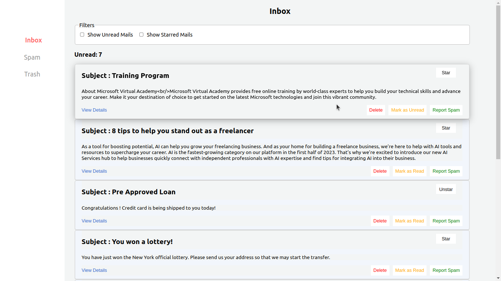
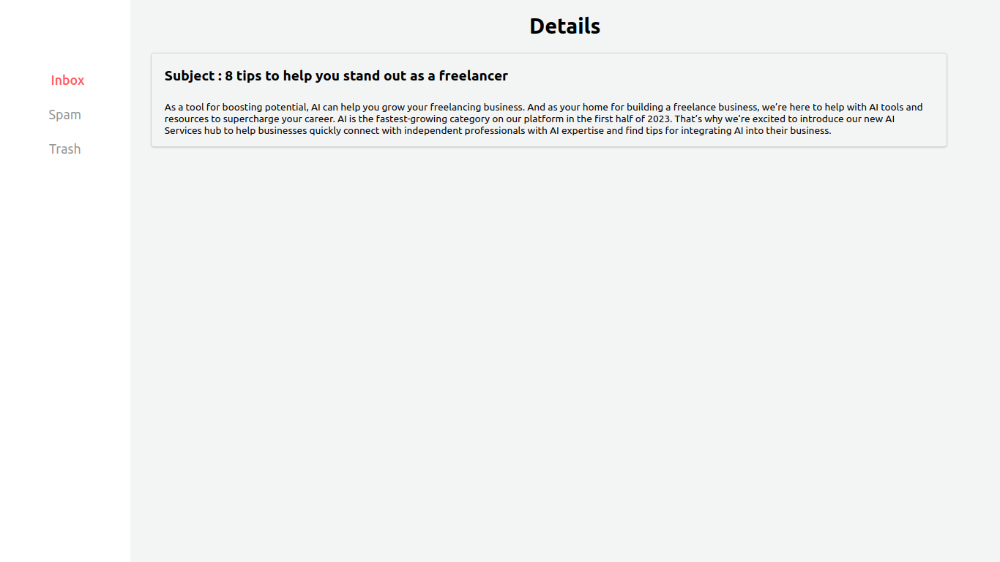
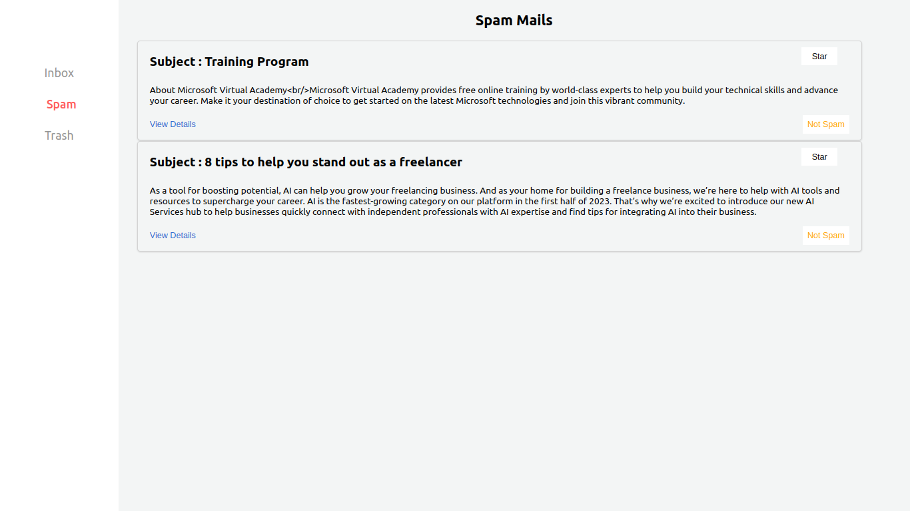
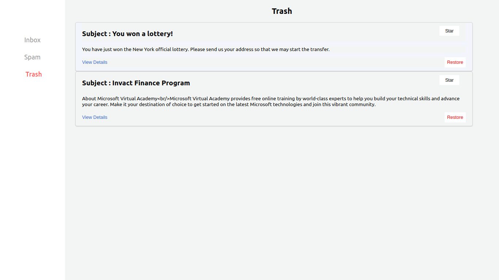

# Mail Box

Mail Box is a React application that provides a user interface for a simplistic mail box.

## Features

- User-friendly interface to manage emails.
- Simple and intuitive design.

## Getting Started

### Prerequisites

- Node.js
- npm (Node package manager)

### Installation

1. Clone the repository:
   ```bash
   git clone https://github.com/pratham2002/mail-box.git
   ```
2. Navigate to the project directory:
   ```bash
   cd mail-box
   ```
3. Install dependencies:
   ```bash
   npm install
   ```

### Running the App

To run the app in the development mode:

```bash
npm start
```

Open [localhost](http://localhost:3000) to view it in the browser. The page will reload if you make edits.

### Building

To build the app for production:

```bash
npm run build
```

## Screenshots

### Inbox



### Email Preview



### SPAM



### Trash



## Learn More

- [Create React App Documentation](https://facebook.github.io/create-react-app/docs/getting-started)
- [React Documentation](https://reactjs.org/)

## License

This project is licensed under the MIT License - see the [LICENSE](LICENSE) file for details.

## Acknowledgments

- [Create React App](https://github.com/facebook/create-react-app)
